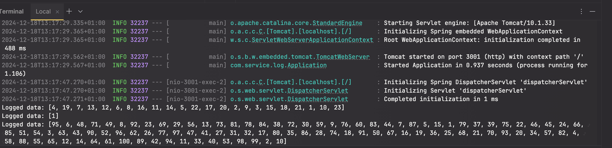

# Service Log

## Overview

`service-log` is a Spring Boot microservice designed to log incoming requests from other services, like `service-shuffle`. It currently logs information to the console for demonstration and testing purposes.

## Features

- Receives HTTP requests with a number to log.
- Outputs log information to the standard output.

## Prerequisites

- Java 17
- Maven
- Spring Boot

## Setup and Installation

1. **Clone the Repository**

   ```bash
   git clone https://github.com/YOUR_USERNAME/service-log.git
   cd service-log

2. **Build the Project**

   ```bash
   mvn clean install

3. **Run the Application**

   ```bash
   mvn spring-boot:run

4. **Make a POST request (make sure service-shuffle service is running as well)**
   ```bash
   curl --location 'http://localhost:3000/shuffle' \
   --header 'Content-Type: application/json' \
   --data '23'

5. **Observe the output in service-log console**

